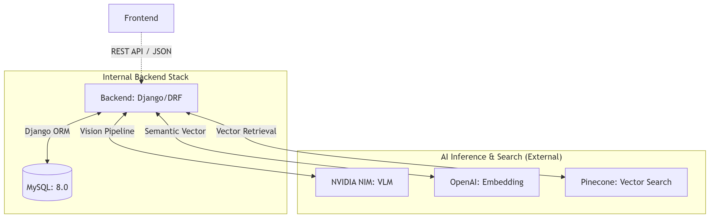

# 🐳 백엔드 인프라 및 서비스 구성 (Backend Infrastructure)

백엔드 서버의 컨테이너 구성, 외부 AI 서비스 연동 및 데이터 영속성 아키텍처를 기술한다.

## 1. 백엔드 서비스 토폴로지 (Backend Topology)

Olfít 백엔드는 복잡한 AI 파이프라인을 오케스트레이션하는 중앙 허브 역할을 수행합니다. Docker Compose 환경 내에서 데이터베이스와 통신하며, 다수의 외부 AI API를 통합하여 서비스를 제공합니다.




### 1.1 핵심 컨테이너 서비스
| 서비스 | 역할 | 베이스 이미지 | 주요 노출 포트 |
| :--- | :--- | :--- | :--- |
| **backend** | API 서버 및 비즈니스 로직 처리 | `python:3.12-slim` | 8000 |
| **database** | 향수 메타데이터 및 이미지 에셋 관리 | `mysql:8.0` | 3306 |

### 1.2 외부 AI 엔드포인트 연동
백엔드는 서버 간 통신을 통해 다음 서비스들을 통합 관리합니다.
- **NVIDIA NIM**: 이미지 분석을 위한 VLM (google/gemma-3n-e4b-it) 호스팅.
- **OpenAI API**: 텍스트 쿼리의 벡터화 (text-embedding-3-small) 수행.
- **Pinecone**: 1536차원 벡터 기반의 실시간 시맨틱 검색.

---

## 2. 런타임 환경 및 영속성 (Persistence)

### 2.1 데이터베이스 구성 및 볼륨
- **볼륨명**: `mysql_data`
- **책임**: 향수 기본 정보, 아우라 프로필(JSON), 이미지 Base64 데이터 및 분석 이력 영속화.
- **최적화**: 백엔드 애플리케이션 실행 전 데이터베이스 헬스체크(`mysqladmin ping`)를 선행하도록 구성.

### 2.2 미디어 및 정적 자산 관리
- **static_volume**: 로컬에서 처리된 향수 이미지 파일(`static/perfumes/images/`) 저장.
- **media_volume**: 분석 시 생성되는 임시 데이터 및 로그 관리.

---

## 3. 백엔드 보안 및 환경설정 (.env)

민감한 자격 증명 및 API 키는 백엔드 컨테이너 실행 시 환경 변수로 주입됩니다.

| 환경변수 그룹 | 주요 항목 |
| :--- | :--- |
| **AI API Keys** | `NVIDIA_API_KEY`, `OPENAI_API_KEY`, `PINECONE_API_KEY` |
| **DB Config** | `MYSQL_DATABASE`, `MYSQL_USER`, `MYSQL_PASSWORD`, `DB_HOST` |
| **Django Secret** | `SECRET_KEY`, `DEBUG`, `ALLOWED_HOSTS` |
| **App Settings** | `PINECONE_INDEX_NAME`, `OPENAI_EMBEDDING_MODEL` |

---

## 4. 백엔드 구동 프로세스
```bash
# 백엔드 컨테이너 및 데이터베이스 빌드 및 기동
docker-compose up --build -d backend database

# 데이터베이스 마이그레이션 및 초기 데이터 로드 (필요 시)
docker-compose exec backend python manage.py migrate
docker-compose exec backend python manage.py load_perfumes
```
