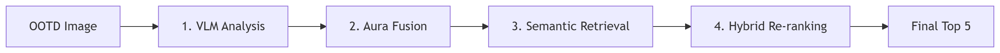

# VLM-추천 통합 파이프라인 (VLM-to-Recommendation Pipeline)

사용자의 OOTD 이미지로부터 시각적 감성을 추출하고 이를 기술적 취향과 결합하여 개인화된 향수 추천을 제공하는 실시간 처리 파이프라인을 설명합니다.

## 1. 전체 데이터 흐름 (System Flow)

1.  **시각 분석 (Vision)**: `VLEngine`이 이미지를 분석하여 시각적 키워드(JSON)를 추출합니다.
2.  **아우라 변환 (Aura)**: `AuraService`가 시각 키워드와 사용자 취향을 융합하여 5축 아우라 벡터와 검색 쿼리를 생성합니다.
3.  **시맨틱 검색 (Retrieval)**: `RecommendationService`가 생성된 쿼리로 Pinecone에서 상위 30개의 후보군을 추출합니다.
4.  **하이브리드 재정렬 (Re-ranking)**: 추출된 후보군을 아우라 유사도와 RAG 점수로 재정렬하여 최종 Top 5를 선정합니다.

---

## 2. VLM 프롬프트 엔지니어링 전략 (Prompt Engineering)

Olfít의 핵심 차별점은 단순히 이미지를 설명하는 것이 아니라, **이미지를 향수 도메인의 언어로 해석**하도록 VLM을 제어하는 데 있습니다.

### 2.1 페르소나 및 역할 정의
- **Persona**: "향수 추천 서비스의 전문 이미지 분석기"
- **Mission**: 이미지에서 향기 계열로 치환 가능한 시각 정보를 추출하고, 이를 구조화된 JSON으로 반환.

### 2.2 엄격한 제약 사항 (Negative Constraints)
할루시네이션(환각)을 방지하고 시스템 안정성을 높이기 위해 다음 제약 사항을 프롬프트에 포함했습니다.
- **객관성 유지**: "향수 이름이나 브랜드명을 상상해서 만들지 마라." (실제 보이는 것에만 집중)
- **형식 고정**: "반드시 JSON 객체 하나만 출력하라.", "코드 블록이나 설명 문구를 절대 포함하지 마라." (파싱 에러 방지)
- **데이터 정제**: "같은 키워드를 반복하지 마라.", "배열은 반드시 JSON 배열로 작성하라."

### 2.3 필드별 추출 전략
- **visual_summary**: 사용자에게 보여줄 '스타일 리포트'용 문장 생성. (50자 이내의 자연스러운 한국어)
- **colors/objects**: 직접적인 성분 매칭을 위한 구체적 명사 추출.
- **mood/scene/season/time**: 추상적인 분위기를 향수 계열(Family) 가중치로 변환하기 위한 메타 키워드 추출.

---

## 3. 주요 서비스 역할

### 3.1 VLEngine (`scent_engine/vision.py`)
- **인프라**: NVIDIA NIM (google/gemma-3n-e4b-it)
- **기능**: 이미지 리사이징, Base64 최적화, 프롬프트 주입 및 JSON 추출.
- **에러 전략**: API 장애 시 `DUMMY_RESULT`를 반환하여 서비스 연속성 확보.

### 3.2 AuraService (`perfumes/services/aura_service.py`)
- **기능**: 시각 벡터(60%) + 취향 벡터(40%) 가중 결합 및 L2 정규화.
- **상세 매핑**: [시각-향기 매핑 규칙](../logic/visual_scent_mapping.md) 참조.

---

## 4. 대칭형 RAG 쿼리 전략 (Symmetric RAG)
임베딩 모델의 매칭 성능을 극대화하기 위해, 검색 쿼리를 향수 도메인 지식 베이스(Pinecone Index)의 문서 구조와 동일한 자연어 구조로 생성합니다.
- **쿼리 구조**: `[시각 요약]. [무드 리스트] 분위기의 [성분 리스트] 향이 느껴지는 [메인 계열] 향수.`
